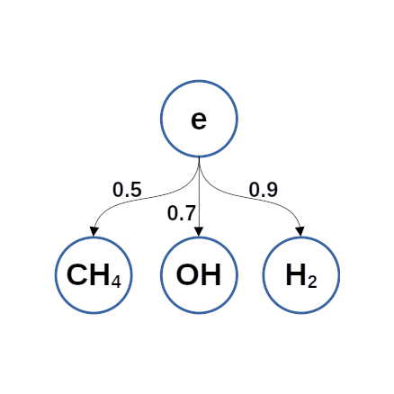

# plasRedChem

    
plasRedChem, is a dimensionality-reduction library for reducing large scale plasma chemical mechanisms to smaller skeletal ones in ZDPlasKin format [1]. Reduction is performed using the Directed Relation Graphs with Error Propagation (DRGEP) method [2,3]. 

**Author: Z. Nikolaou (2025).** 

**References:** 

 [1] S. Pancheshnyi, B. Eismann, G.J.M. Hagelaar, and L.C. Pitchford. Computer code ZDPlasKin: http://www.zdplaskin.laplace.univ-tlse.fr. University of Toulouse, LAPLACE, CNRS-UPS-INP, Toulouse, France, 2008

 [2] P. Pepiot Desjardins, H. Pitsch. Combust. Flame 154 (2008) 67-81. 

 [3] T. Lu, C.K. Law. Proc. Combust. Inst. 30 (2005) 1333-1341. 

User inputs:
------------
 1. A detailed chemical mechanism in ZDPlasKin format e.g. *kinet.inp*, *kinet.txt* etc.  

 2. Individual reaction rate data in a binary Fortran format obtained by solving a canonical problem-please use the provided *pcmo.f90* module under *./utils/* in your main program to write the reaction rate data in the necessary format. 

 3. A control file for the reduction as in the *./examples/* directory. In the control file the user sets the name of the chemical mechanism  to use, the number of reaction-rate data sets to use, the indices of the target species (in the list of the detailed chemistry), and for each target species the acceptance threshold.    

Installation: 
-------------

1. Set environment variables: 
   
   *source setenv.sh*
   

   Here, you may set the Fortran compiler and the relevant compiler options (by default gfortran is used).  

2. *make clean*, then *make redChem* to create the *redChem* executable under *./bin/*.  

To use:
-------

Have a look at the *./examples/* directory on how to set up your own working directory. 
Preferably, create a working directory different from the installation directory, and add the *./bin/* directory to your system *PATH*.  

